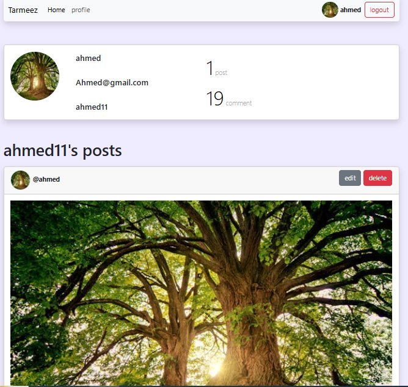

<h1>#social media project</h1>
<h3>#موقع تواصل اجتماعي (html - css - js - bootstrap)</h3>

<h4>موقع تواصل اجتماعي (html - css - js - bootstrap) 
تعلمت به احد اشهر واهم مفاهيم java script وهو ال api وكيفيه التعامل مع البيانات باستعمال مكتبه axios وال postman </h4>

 

